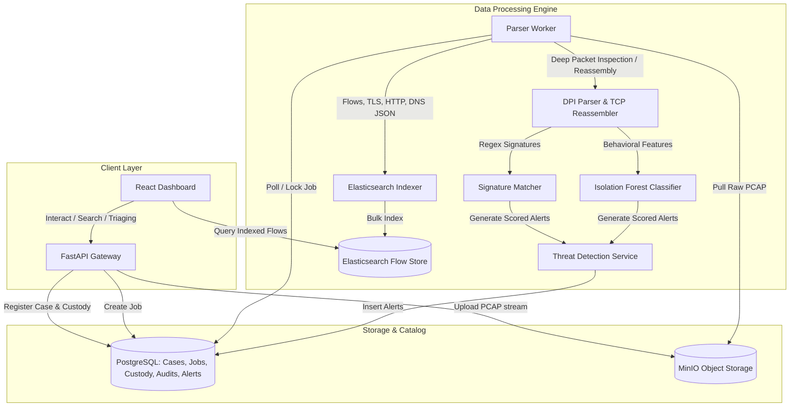

# NetPack: Network & Packet Forensics Platform
## Project Proposal & System Documentation

---

### 1. Synopsis / Abstract
**NetPack** is an evidence-first, centralized network forensics and traffic analysis platform designed to help law enforcement agencies, cyber crime departments, and security analysts ingest, inspect, and reconstruct network activity. Modern threat actors use advanced obfuscation, DNS/ICMP tunneling, and encrypted channels to conduct data exfiltration and command-and-control (C2) operations, which traditional perimeter tools fail to flag.

NetPack addresses these challenges by transforming raw packet capture files (PCAPs) into structured, searchable evidence. Upon upload, NetPack immediately computes a cryptographic SHA-256 hash to establish a chain of custody. An asynchronous processing worker decodes common protocols (HTTP, DNS, TLS, ICMP, etc.) and indexes flow data into Elasticsearch for sub-second search. It leverages a dual-engine architecture for threat detection: signature-based regex matching for known malicious patterns and an unsupervised machine learning model (Isolation Forest) for behavioral anomalies. Finally, NetPack delivers an interactive React-based dashboard complete with force-directed network graphs, transaction timelines, and append-only audit tracking, concluding in a court-admissible PDF forensic report export package.

---

### 2. Literature Review / Existing Innovation & Technology
Network visibility and forensic analysis have traditionally relied on discrete, disconnected utilities. NetPack integrates these functionalities to provide an investigation-first solution.

| Technology | Purpose | Key Strengths | Limitations & Forensic Gaps | NetPack Value Addition |
| :--- | :--- | :--- | :--- | :--- |
| **Wireshark / tshark** | Packet capture & deep protocol analysis. | Granular packet-level parsing, support for thousands of protocols. | Desktop-bound; lacks centralized database case management, collaborative role-based access, and chain-of-custody tracking. | Server-side execution; centralizes evidence under case folders, allowing secure, multi-analyst access. |
| **Zeek (formerly Bro)** | Behavioral logs & network security monitoring. | Converts raw packets into structured, metadata-rich connection logs. | Not an end-to-end product; requires significant scripting, separate database integration, and custom frontend build. | Integrates Zeek-like protocol parsing (HTTP, DNS, TLS) with PostgreSQL metadata store and a pre-built React frontend. |
| **Suricata / Snort** | Signature-based Intrusion Detection (IDS). | High-performance regex and rule-matching for known malware payloads. | Blind to zero-day threats, anomaly behaviors, and lacks forensic case management/reporting. | Integrates signature rules alongside ML-driven anomaly models under a unified alerts interface. |
| **ELK Stack (Elasticsearch, Logstash, Kibana)** | Scalable log indexing & data visualization. | Excellent search performance, scalable architectures. | Not a forensics-centric tool; lacks append-only audit records, custody validation, and legal PDF generators. | Wraps Elasticsearch under case-scoped queries, enforcing role-based filters and automated custody reporting. |

---

### 3. Your Approach to Solve the Problem
NetPack solves the packet forensics problem through a secure, structured, and modular architecture. 



#### Ingestion & Cryptographic Verification
1. **Intake Flow:** An investigator uploads a PCAP file via a multipart POST request. 
2. **Stream-Hashing:** To guarantee evidence integrity, the backend calculates the SHA-256 hash in a single pass while streaming the bytes directly to a secured MinIO bucket.
3. **Registration:** If the hash does not exist in the case database, a new entry is committed in PostgreSQL, locking the initial state of the evidence and logging an append-only *Chain of Custody* event.

#### Asynchronous Processing Boundary
1. **Parser Jobs:** A parser job is inserted into `parser_jobs` in a `queued` state.
2. **Worker Isolation:** The worker checks out jobs, downloads raw PCAPs from MinIO, and parses packets using a generator-based Scapy `PcapReader` (avoiding loading large files fully into memory).
3. **TCP Reassembly & DPI:** Custom state-trackers reassemble TCP flows, extract payloads, and parse standard protocols (HTTP host/URI, DNS query entropy, TLS SNI).
4. **Elasticsearch Indexing:** Extracted flow records are bulk-indexed into Elasticsearch, keyed with case and evidence IDs.

#### Threat Detection Engine
1. **Signature Engine:** A signature matching component scans payloads against regex patterns (e.g., matching DNS tunneling query patterns or known bad HTTP headers).
2. **ML Anomaly Scoring:** Flows are transformed into a feature schema (byte direction counts, flow duration, port rarity, query entropy). The worker feeds this vector into a trained `Isolation Forest` model, tagging suspicious flows with anomaly scores.
3. **Alert Logging:** Alerts are written directly back to PostgreSQL, ready for investigator triage.

---

### 4. Road Map / Flow Diagram
The development path for NetPack is structured into 6 sequential phases, taking it from a core evidence store to a horizontally scalable streaming platform.

```
       Phase 1                    Phase 2                    Phase 3
+--------------------+     +--------------------+     +--------------------+
|  Evidence Intake   |     | Asynchronous DPI   |     | Investigator Dash  |
|  & Case Schema     | --> | & ES Indexing      | --> | & Alert Triage     |
|  (Postgres/MinIO)  |     | (Scapy, ES, JSON)  |     | (React, D3, Flow)  |
+--------------------+     +--------------------+     +--------------------+
                                                                |
       Phase 6                    Phase 5                    Phase 4
+--------------------+     +--------------------+     +--------------------+
| Live Stream/Scale  |     | Court Reporting    |     | Threat Detection   |
| (Kafka, K8s, SIEM) | <-- | & Export Packages  | <-- | & ML Scoring       |
|                    |     | (PDF, Manifests)   |     | (Rules, Isolation) |
+--------------------+     +--------------------+     +--------------------+
```

#### Detailed Phase Milestones
* **Phase 1: Evidence Intake & Case Schema (Completed)**
  * Design database schemas for user management, cases, evidence registry, immutable audit logs, and custody transfers.
  * Establish MinIO infrastructure for raw storage and implement streaming uploads with SHA-256 extraction.
* **Phase 2: Asynchronous DPI & Search (Completed)**
  * Initialize the FastAPI backend app structure.
  * Build the python-based parsing worker that handles queue-locking, download, and Scapy-based protocol dissection.
  * Map Elasticsearch index settings and implement bulk indexing for flows.
* **Phase 3: Investigator Dashboard & Review UI (Completed)**
  * Launch React/Vite dashboard.
  * Connect case list, evidence details, and custody log screens.
  * Build D3.js-based force-directed network graphs representing communication maps.
  * Build flow search filtering tables and timeline logs.
* **Phase 4: Threat Detection & ML Scoring (Completed)**
  * Create the signature rule processor matching regex definitions.
  * Implement feature engineering scripts converting flow properties to tensors/features.
  * Integrate the scikit-learn `Isolation Forest` anomaly detector to score flows.
* **Phase 5: Forensic Reporting & Export Packages (Completed)**
  * Design and code automated PDF generators containing case metadata, custody timelines, hashes, and alert list.
  * Create zip-based Export Bundles with manifests for legal presentation.
* **Phase 6: Live Streaming, Kafka & Deployment Scale (Future)**
  * Integrate Apache Kafka to queue live packet streams from network sensors.
  * Containerize workers into Kubernetes pods with auto-scaling rules.
  * Provide SIEM exporting configurations for external dashboards.

---

### 5. Tools & Technologies to be Used

* **Programming Languages:** Python 3.10+ (Backend & ML), TypeScript / JavaScript (Frontend)
* **Application Frameworks:** FastAPI (Fast backend REST API), Vite + React (Frontend SPA)
* **Network & DPI Engines:** Scapy (Python packet sniffing/reading library), Custom TCP Reassembly stack
* **Data Stores:**
  * **PostgreSQL:** Authority database storing users, cases, audit logs, chain of custody, jobs, and alerts.
  * **Elasticsearch:** Fast flow-log indices supporting case-scoped keyword searches, filters, and histograms.
  * **MinIO:** S3-compatible local object storage for PCAP binary objects and report outputs.
* **Artificial Intelligence & Anomaly Detection:**
  * **Scikit-Learn:** Isolation Forest model training, parameter validation, and classification.
  * **Pandas:** Feature engineering, data normalization, and dataframe loading.
  * **Joblib:** Binary serialization of trained machine learning models.
* **Infrastructure & Orchestration:**
  * **Docker & Docker Compose:** Standardized developer environments (PostgreSQL, Elasticsearch, MinIO, workers).
  * **Kafka (Roadmap):** Event streaming backplane for handling high-velocity live capture ingestion.
* **Visualization Libraries:**
  * **D3.js:** Force-directed graphing rendering client-side interactive network topologies.
  * **TailwindCSS:** Premium interface styling, flex grids, and sleek dark modes.

---

### 6. Challenges / Risks in Implementing the Final Prototype

1. **High Volume PCAP Processing & Resource Exhaustion**
   * *Risk:* Multi-gigabyte PCAPs can overwhelm server memory when parsing packets via typical Scapy lists, resulting in Out-Of-Memory (OOM) worker crashes.
   * *Mitigation:* Employ generator-based iterative file streaming (`PcapReader`) to parse and bulk-index packets in chunks, keeping the worker's memory footprint constant regardless of file size.
2. **Data Consistency Across Store Boundaries**
   * *Risk:* If index indexing to Elasticsearch fails but Postgres commits the job status as successful, flows become unsearchable but labeled as parsed.
   * *Mitigation:* Implement strict database transactional boundaries; keep worker jobs retryable and make indexing logic idempotent by calculating deterministic Elasticsearch document IDs (`flow_id` derived from packet signature).
3. **Alert Fatigue / False Positives in ML Scoring**
   * *Risk:* Unsupervised anomaly detection (Isolation Forest) might flag benign rare network behaviors (e.g., an occasional software update), flooding investigators with alerts.
   * *Mitigation:* Allow human-in-the-loop triaging via the frontend where investigators can mark alerts as "false positive." These labels write back to Postgres, logging parameters to adjust isolation forest contamination thresholds.
4. **Traffic Encryption Limitations**
   * *Risk:* Over 80% of web traffic uses TLS/HTTPS, rendering deep payload inspection ineffective.
   * *Mitigation:* Focus analytics on metadata (TLS SNI strings, certificate issuers, JA3/JA4 cryptographic fingerprints) and traffic metrics (beaconing intervals, transmission durations, byte ratios) to deduce anomalies without decrypting payloads.
5. **Chain of Custody and Evidence Admissibility**
   * *Risk:* Digital evidence is easily dismissible in court if there is any window where files could have been altered without audit.
   * *Mitigation:* Calculate SHA-256 hashes immediately at the HTTP stream gateway before writing to disk. Enforce database constraints and application access rules that prohibit editing or deleting custody entries.

---

### 7. Possible Outcome of Your Work

NetPack delivers a highly secure cyber-forensics platform that transforms raw PCAPs into legal digital evidence:
* **Interactive Threat Map:** A graphical representation of the network topology with node scaling, letting investigators spot high-risk IPs immediately.
* **Unified Flow Search:** Under-the-hood Elasticsearch integration lets analysts query millions of sessions by IP, protocol, hostnames, and time boundaries.
* **AI Anomaly Indicator:** Zero-day exfiltrations, covert tunnels, and beaconing behaviors are automatically scored and flagged by the Isolation Forest model.
* **Court-Admissible Forensics:** Automatically compiled PDF case files incorporating SHA-256 file hashes, investigator notes, threat timelines, and append-only chain-of-custody logs.
* **Complete Audit Trail:** Every action (who viewed which PCAP, when a search was executed) is logged, satisfying legal compliance standards.

---

### 8. Accomplishments to Date

NetPack is already a working, feature-rich prototype with the following components successfully built:

* **Relational Database Engine:** Setup complete PostgreSQL tables in `infra/postgres/init/001_schema.sql`, featuring custom types for job, alert, and case states, with full audit constraints.
* **MinIO Secure Storage:** Working evidence intake API that reads PCAP files, calculates SHA-256 on the fly, stores them under encrypted case buckets, and logs custody actions.
* **Deep Packet Inspection Stack:** Python parsing worker in `data_processing/dpi_engine.py` equipped with HTTP header decoding, DNS query Shannon entropy calculation (to flag tunneling), and TCP session reassembly.
* **Trained Anomaly Classifier:** Built feature extraction pipelines and successfully trained an Isolation Forest model (serialized at `ml_models/saved_models/anomaly_detector.joblib`) that scores packet datasets.
* **Signature Rules Handler:** Regular-expression matching engine that processes incoming flow payloads against signature databases defined in `data_processing/rules/signatures.json`.
* **Flow Indexing pipeline:** `data_processing/index_metadata.py` handles batch indexing of parsed packet documents into Elasticsearch indexes.
* **FastAPI Backend Gateway:** Enforces role-based permissions (admin/investigator/auditor) and exposes case, upload, alert, statistics, graph, and PDF report endpoints.
* **Investigator React Interface:** Completed high-fidelity dashboard in React/TS featuring:
  * **Cases page** to register/manage active cases.
  * **Case Details page** showing custody events, evidence logs, and file processing indicators.
  * **Interactive D3.js force graph** displaying traffic relations.
  * **Timeline logs** and tabular flow search views with instant filter capability.
  * **Alert triage console** allowing investigators to update alert states and insert comments.
* Github link: [https://github.com/drumilbhati/NetPack](https://github.com/drumilbhati/NetPack)
