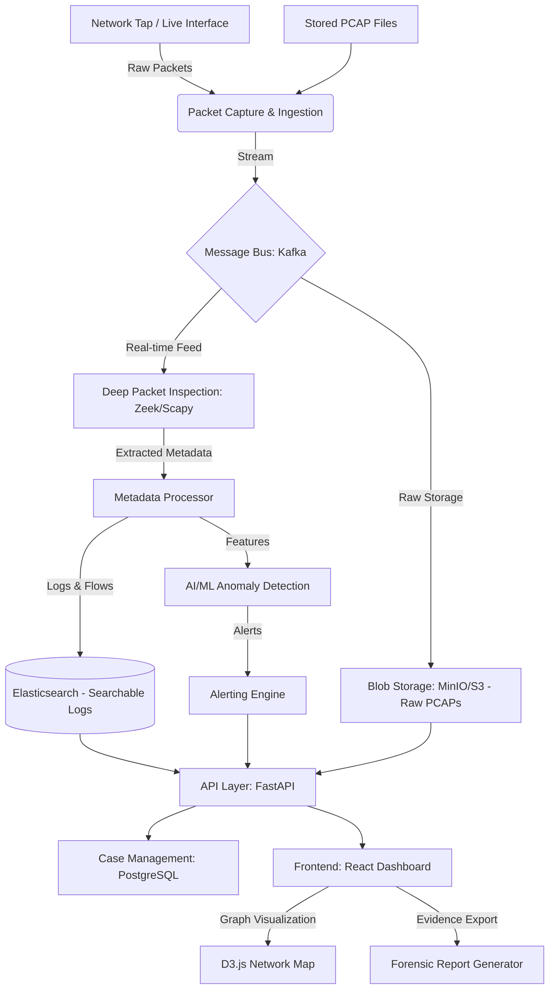

# System Architecture: Network & Packet Forensics Platform

## 1. High-Level Overview
The platform is designed as a modular, high-throughput system that transforms raw network packets into actionable forensic evidence and intuitive visualizations. It bridges the gap between low-level packet data and high-level investigative workflows.

## 2. System Architecture Diagram (Conceptual)

## 3. Core Modules & Component Details

### 3.1 Packet Processing Pipeline
*   **Ingestion:** Uses `libpcap` wrappers (Scapy for specialized tasks, Zeek for high-speed passive analysis).
*   **Stream Management:** **Apache Kafka** acts as a buffer to prevent data loss during traffic spikes, decoupling capture from heavy analysis.
*   **DPI Engine:** Reconstructs sessions (HTTP, DNS, SMTP) and extracts metadata (TLS handshakes, JA3 fingerprints) to analyze encrypted traffic without decryption.

### 3.2 Data Storage Strategy
*   **Elasticsearch:** Primary store for flow data and protocol metadata, enabling sub-second searches for investigators.
*   **PostgreSQL:** Stores structured data: user accounts, case files, investigation notes, and **Evidence Hashes (SHA-256)** for tamper-proofing.
*   **MinIO:** Securely stores the original raw PCAP files, required for deep forensic validation.

### 3.3 Intelligence & Analytics Layer
*   **Signature Matching:** Uses Suricata/Snort-style rules to catch known malware C2 (Command & Control) traffic.
*   **AI Anomaly Detection:** 
    *   **Isolation Forest / Autoencoders:** To detect behavioral outliers (e.g., unusual data volumes or new destination IPs).
    *   **Metadata-based Classification:** Identifying traffic types (streaming vs. exfiltration) in encrypted tunnels.

### 3.4 Forensic & Legal Integrity
*   **Chain of Custody:** Every action taken by an investigator is logged in an immutable audit trail.
*   **Evidence Hashing:** PCAPs are hashed immediately upon ingestion. Any report generated includes these hashes to prove the data hasn't been altered.
*   **Report Generation:** Automated PDF/CSV exports formatted for legal submission, including timestamps and network flow diagrams.

## 4. User Interface (The Investigator Experience)
*   **Network Graph:** A D3.js force-directed graph showing "Who is talking to Whom," with red nodes indicating suspicious activity.
*   **Timeline View:** A linear representation of events, allowing investigators to "scroll back in time" to see how an attack started.
*   **Drill-down:** Clicking a suspicious connection allows the investigator to see the exact packets and decoded payloads.

## 5. Security & Compliance
*   **RBAC:** Role-Based Access Control (Admin vs. Investigator vs. Auditor).
*   **Encryption:** Data at rest (AES-256) and in transit (TLS 1.3).
*   **Audit Logging:** Comprehensive logs of all database queries and file accesses.

## 6. Implementation Milestones
1.  **Phase 1:** Core Capture & DPI (Zeek + Kafka + Elasticsearch).
2.  **Phase 2:** Basic UI & Search (React + FastAPI).
3.  **Phase 3:** AI/ML Integration (Anomaly detection models).
4.  **Phase 4:** Forensic Reporting & Evidence Management.
5.  **Phase 5:** Scalability (Docker/K8s) & SIEM Integration.
