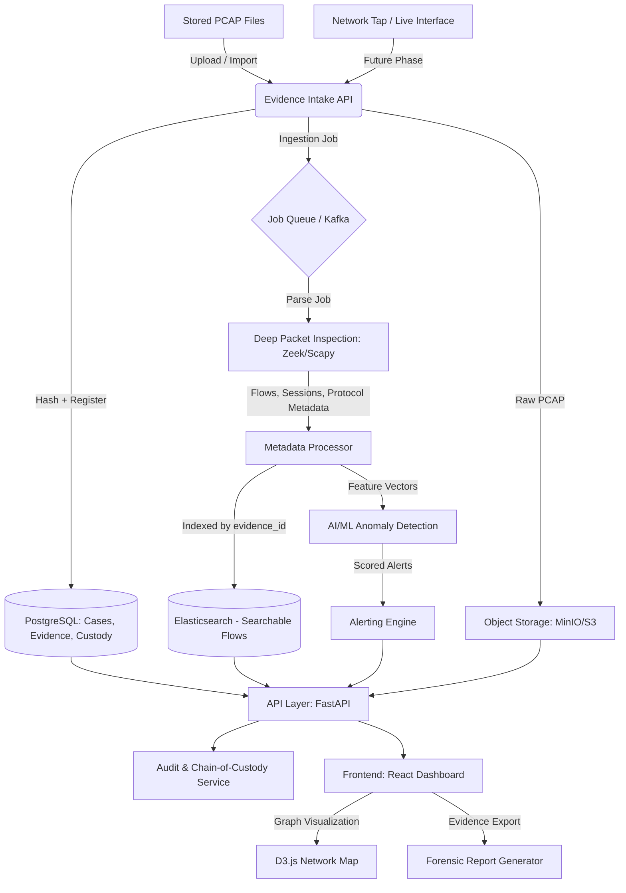

# System Architecture: Network & Packet Forensics Platform

## 1. High-Level Overview
The platform is designed as an evidence-first network forensics system that transforms raw PCAP evidence into searchable traffic metadata, alerts, audit records, and legally defensible reports. The first MVP focuses on reliable PCAP import, forensic search, chain-of-custody, and analyst workflows. Live high-throughput capture is treated as a later scaling phase that reuses the same ingestion and evidence model.

## 2. System Architecture Diagram (Conceptual)

## 3. Core Modules & Component Details

### 3.1 Evidence Intake & Packet Processing Pipeline
*   **Evidence Intake:** Every upload/import creates a canonical `evidence_id`, calculates a SHA-256 hash before analysis, stores the raw PCAP, and records the first chain-of-custody event.
*   **Job Boundary:** Parsing is asynchronous. The MVP can use a local durable job table or worker queue; Kafka is introduced when live capture and horizontal scaling are required.
*   **DPI Engine:** Reconstructs flows and sessions where possible, decodes common protocols (HTTP, DNS, FTP/SMTP where available), extracts TLS metadata and fingerprints (JA3/JA4 where supported), and records parser failures without losing the original evidence.
*   **Idempotency:** Re-importing the same PCAP should be detected by hash. Parser jobs must be retryable without creating duplicate flow or alert records.

### 3.2 Data Storage Strategy
*   **PostgreSQL:** System of record for users, roles, cases, evidence records, evidence hashes, custody events, parser job status, report metadata, and audit logs.
*   **Elasticsearch:** Search index for derived flow/session/protocol metadata. Every indexed document must include `case_id`, `evidence_id`, parser version, packet/time bounds, and source raw-file reference.
*   **MinIO/S3:** Immutable-style object storage for original raw PCAP files and generated exports. Object keys are derived from `case_id` and `evidence_id`, not user-supplied filenames.
*   **Consistency Model:** PostgreSQL is authoritative. If indexing or ML scoring fails, evidence remains registered with a failed/retryable processing state rather than becoming invisible.

### 3.3 Intelligence & Analytics Layer
*   **Signature Matching:** Uses Suricata/Snort-style rules to catch known malware C2 (Command & Control) traffic.
*   **AI Anomaly Detection:** 
    *   **Feature Schema:** Flow duration, bytes/packets in each direction, protocol, ports, DNS query entropy, destination rarity, beaconing intervals, TLS fingerprints, and time-window baselines.
    *   **Isolation Forest / Autoencoders:** To detect behavioral outliers after a baseline is established for a case/network.
    *   **Analyst Feedback:** Alerts track status, severity, model/rule source, explanation features, false-positive marking, and investigator notes.

### 3.4 Forensic & Legal Integrity
*   **Chain of Custody:** Every evidence action is recorded as an append-only event: upload, hash, storage write, parser run, view, search, export, custody transfer, and report generation.
*   **Evidence Hashing:** PCAPs are hashed immediately upon ingestion. Reports include the original hash, parser version, report generation timestamp, and export hash.
*   **Audit Logging:** All case access and evidence access is audit logged with actor, role, timestamp, action, target object, and request metadata.
*   **Report Generation:** Automated PDF/CSV exports formatted for legal submission, including custody timeline, evidence hashes, selected flow records, alert explanations, and network flow diagrams.

## 4. User Interface (The Investigator Experience)
*   **Network Graph:** A D3.js force-directed graph showing "Who is talking to Whom," with red nodes indicating suspicious activity.
*   **Timeline View:** A linear representation of events, allowing investigators to "scroll back in time" to see how an attack started.
*   **Drill-down:** Clicking a suspicious connection allows the investigator to see the exact packets and decoded payloads.

## 5. Security & Compliance
*   **RBAC:** Role-Based Access Control (Admin vs. Investigator vs. Auditor) enforced at the API and query layer with case-scoped permissions.
*   **Authentication:** Backend endpoints require authenticated users before evidence upload, search, export, or case management.
*   **Upload Controls:** Enforce file type checks, size limits, malware-safe handling, object key sanitization, and no trust in user-supplied filenames.
*   **Encryption:** Data at rest for PostgreSQL, Elasticsearch, and object storage; TLS for API and service-to-service traffic in deployed environments.
*   **Secret Management:** No hardcoded credentials; local `.env` for development and managed secrets for production.
*   **Audit Logging:** Comprehensive append-only logs of all evidence, case, database query, file access, and export actions.

## 6. Implementation Milestones
1.  **Phase 1:** Evidence intake, hashing, secure raw PCAP storage, PostgreSQL case/evidence model, and audit trail.
2.  **Phase 2:** Asynchronous PCAP parsing, DPI metadata extraction, Elasticsearch indexing, and search API.
3.  **Phase 3:** Investigator dashboard, case search, graph/timeline views, and alert review workflow.
4.  **Phase 4:** Signature detection, anomaly scoring, analyst feedback, and evaluation dataset.
5.  **Phase 5:** Forensic reporting, export hashing/signing, and custody timeline.
6.  **Phase 6:** Live capture, Kafka-based streaming, horizontal scaling, Kubernetes, and SIEM integration.
